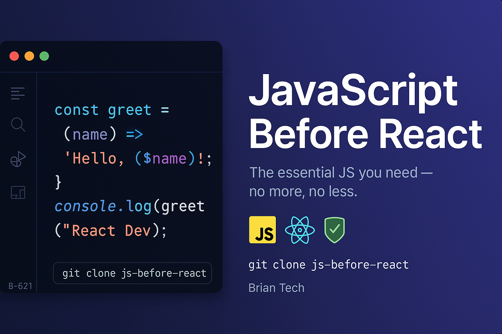

<p align="center">
  
</p>


<h1 align="center">🧠 JavaScript Before React</h1>

<p align="center">
  Learn just enough JavaScript to start building in React — no fluff.
</p>

<p align="center">
  
  
  
</p>

---

> ⚠️ **This repo is under construction. Content is being added. Stay tuned!**
>  
> Follow the repo or check back soon — we're building something awesome to help you learn JavaScript for React the right way.  
>  
> — **Brian Tech**


## 🚀 Why This Exists

React is JavaScript. But not all of JavaScript is needed to get started. This guide helps you focus on **just the essentials**, so you don’t waste time or get overwhelmed.

If you’ve asked yourself:
- “Do I need to master JavaScript before React?”
- “What exactly do I need to know?”
- “Where should I start?”

This repo is for you.

---

## 📚 What You'll Learn

| ✅ Topic | 💡 Description |
|----------|----------------|
| Variables & Data Types | `let`, `const`, types like strings, numbers, arrays, and objects |
| Functions & Scope | Arrow functions, function expressions, block scope |
| Arrays & Objects | Creating, modifying, looping |
| ES6+ Features | Destructuring, spread/rest, template literals |
| Array Methods | `map`, `filter`, `reduce`, and how React uses them |
| Promises & Async/Await | Handle async code without pain |
| Modules | `import` and `export` — just like React components |
| DOM vs JSX | Why React uses JSX instead of manipulating the DOM directly |

---

## 📂 Folder Structure

```

js-before-react/
├── 01-variables-and-data-types/
├── 02-functions-and-scope/
├── 03-arrays-and-objects/
├── 04-es6-features/
├── 05-dom-basics-vs-jsx/
├── 06-callbacks-promises-async-await/
├── 07-modules-and-import-export/
└── mini-projects/

````

---

## ✨ Mini Projects

- ✅ `todo-cli.js` — A simple To-Do app in the terminal
- ✅ `array-methods-challenge.js` — Practice with `map`, `filter`, and `reduce`

---

## 🛠️ How to Use

1. Clone the repo
   ```bash
   git clone https://github.com/B-6219/js-before-react.git
   cd js-before-react
````

2. Go through the folders in order
3. Run `.js` files in the browser console or Node
4. Practice, tweak, break things, and learn!

---

## 🙌 Contribute

Got suggestions or examples to share? Open a pull request or start a discussion — contributions are welcome!

---

## 🧑‍💻 Made for New Devs

You're closer to React than you think. Let’s build the foundation together. 🔥

**By Brian Tech**
